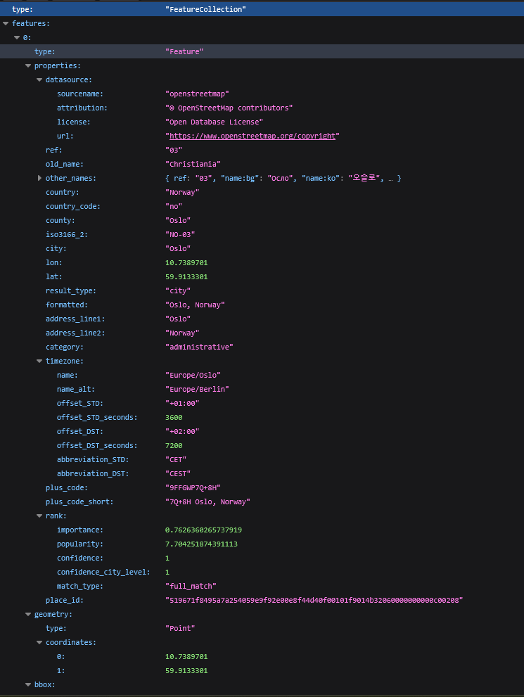
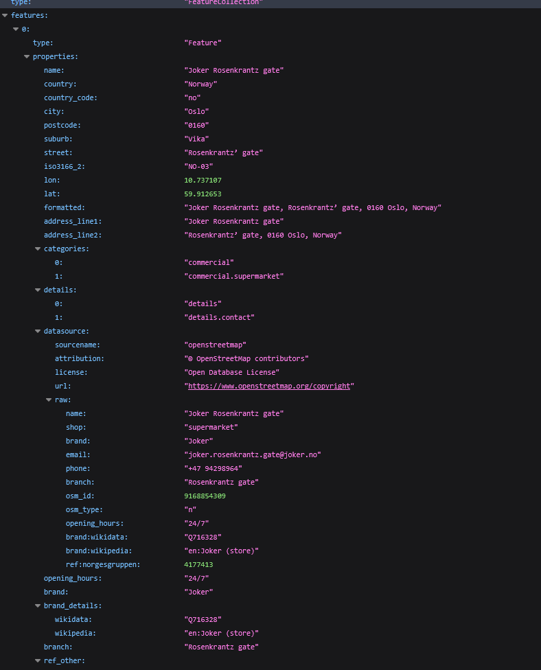
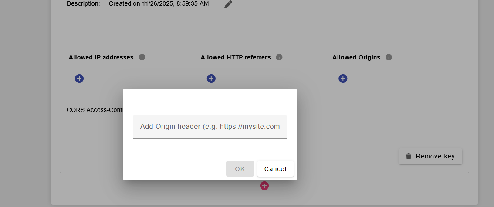
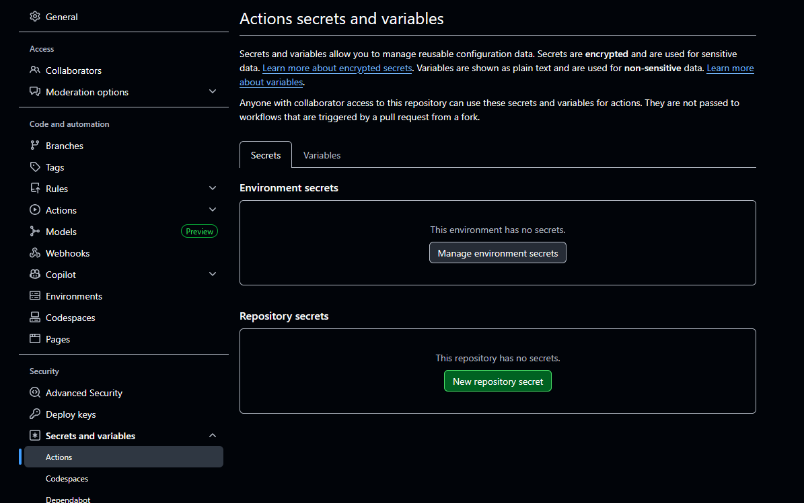

# Simplifisert Google Maps

I denne oppgaven skal dere prøve å lage deres egen forenklet utgave av Google Maps. 
Dere skal gjøre dette via en kombinasjon av verktøy.

1. Leaflet JS: En enkel kartpakke som kan brukes i deres egne prosjekter.

2. Geoapify: En api som inneholder stedsdata, og kan hente informasjon om lokasjoner i et område basert på lat og lon koordinater. Denne apien krever også at dere leverer en api nøkkel med requesten, som vil si dere må håndtere den på en god og sikker måte. Hvis API nøkkelen havner på GitHub med et uhell, må veileder kontaktes, og dere får hjelp å generere en ny. Apinøkkelen er gratis å hente ut fra GeoApify sine dokumentasjons-sider. Dere trenger bare å lage en bruker via deres google kurs-epost, og lage et nytt prosjekt i deres admin panel (her kan dere få hjelp fra en veileder.) Nøkkelen er gratis å bruke opp till 3000 requests daglig, som er mer enn nok for denne oppgaven (dere blir heller ikke belastet for overbruk, dere får bare automatisk blokkert requests). Dere skal heller ikke legge inn noe betalingsinformasjon for denne oppgaven. 

## Gjennomføring

Dere skal bruke leaflet JS, sammen med OpenStreetMap tiles, for å generere et kart over et område. Brukeren skal kunne flytte kartet, og kartet i seg selv skal bestemme senter på søkeområdet brukeren ønsker å finne detaljer om. Hvis kartet er flyttet over Oslo S, skal bruker kunne finne detaljer om lokasjoner inærheten av Oslo S. Er kartet flyttet over Tyholttårnet i Trondheim, skal brukeren finne informasjon om lokasjoner rundt det. 

Siden må derfor inneholde følgende:

* Et kart med tiles fra OpenStreetMap
* Pins med lokasjoner, basert på data fra GeoApify
* Et søkefelt hvor bruker kan søke etter et spesifikt stedsnavn, for så å flytte kartet til dette spesifikke området. Her kan dere bruke GeoApify sin Geocoding api, som tar in tekst, og prøver å finne coordinatene som matcher. (inkludert adresser)
* Et set med filtre hvor brukeren kan filtrere for spesifikke lokasjoner (kafe, restaurant, hotell osv.)

### Hvordan bruke LeafletJS?

Kartverktøyet dere skal bruke kommer fra pakken Leafletjs. Dette er en fullstendig kartplatform som bruker OpenStreetMap som sin tile-maker. Den henter kartdata og kartkoordinater derfra, og rendrer dette ut som et interaktivt kart en nettside kan bruke.

Dere har flere forskjellige valg når det kommer til installasjon av Leafletjs. Bruker dere vanlig (vanilla) Javascript, kan dette gjøres ved å hente en hosted utgave av javascripten fra Leaflet sin offisielle host. Da inkluderer vi bare en link til disse i Header på html siden vår, der vi også linker vår egen css og js.

```
<link rel="stylesheet" href="https://unpkg.com/leaflet@1.9.4/dist/leaflet.css" integrity="sha256-p4NxAoJBhIIN+hmNHrzRCf9tD/miZyoHS5obTRR9BMY=" crossorigin="" />
<script src="https://unpkg.com/leaflet@1.9.4/dist/leaflet.js" integrity="sha256-20nQCchB9co0qIjJZRGuk2/Z9VM+kNiyxNV1lvTlZBo=" crossorigin=""></script>
```

Hvis dere velger å bruke Node og NPM kan leaflet også installeres via npm:

```
npm install leaflet
```

Leaflet eksponerer et L objekt til dere, som dere kan hente ut i deres egen kode. 

Prøv å legg inn følgende demonstrasjonskode:

Legg først in en div med id Map i html siden deres
```
<div id="map"></div>
```

Pass så på at div har en definert høyde i css:
```
#map { height: 180px; }
```

Vi kan så hente inn, og definere kartet vårt i vår javascriptfil via L objektet fra Leaflet:
```
var map = L.map('map').setView([51.505, -0.09], 13);
```

Her forteller vi at vi skal lage et kart i elementet med ID 'map' knyttet til koordinatene 51.505, -0.09. Dette viewet skal ha Zoomlevel 13.

Dere ser nok ikke så mye enda, men det er fordi vi ikke har hentet inn TileSettet enda. aka bakgrunnsbildene som skal vise selve kartet.

```
L.tileLayer('https://tile.openstreetmap.org/{z}/{x}/{y}.png', {
    maxZoom: 19,
    attribution: '&copy; <a href="http://www.openstreetmap.org/copyright">OpenStreetMap</a>'
}).addTo(map);
```

her definerer vi et tileLayer på vårt L objekt, som knyttes til et set med OpenStreetMap tiles i en z,x,y koordinat. Legg merke til at de hentes fra SetView ovenfor automatisk. z kan tenkes på som zoom level, x er latitude koordinater (51,505), og y er longitude koordinater (-0.09). Forhåpentligvis nå, skal dere ha et kart over London i deres view. 

Vi kan legge til markører til kartet vårt, som også kan ha små popup bobler når de blir trykket på:
```
L.marker([51.5, -0.09]).addTo(map)
    .bindPopup('A pretty CSS popup.<br> Easily customizable.')
    .openPopup();
```

Her legger vi en markør på koordinatene 51.5 og -0.09, som inneholder en liten popup med teksten `A pretty CSS popup.<br> Easily customizable.` når den blir trykket på.

## GeoApify

GeoApify er stedet dere henter stedsdata fra. Her bruker dere primært to av deres apier. 

### GeoCode:

Geocoding apiet er der hvor de prøver å matche et stedsnavn til, bl.a. et set med koordinater. 

Nedenfor ser dere en eksempelurl (uten apinøkkel, den må dere hente selv) som returnerer informasjon om Oslo.

`https://api.geoapify.com/v1/geocode/search?text=Oslo&apiKey=LeggInnDeresApiNøkkelHer`

Hvis dere bruker den url ovenfor i nettleseren deres, vil dere få tilbake et json objekt, som ser noelunde slik ut:



Legg merke til bl.a. lon og lat, som er koordinater dere kan bruke for å flytte map-viewet til denne lokasjonen. 
Det er deres oppgave å passe på at deres kode kan behandle denne dataen korrekt. 

### Places api

Places er en annen api GeoApify tilgjengeliggjør for oss, hvor vi kan hente ut stedsinformasjon basert på Lon og Lat koordinater, her bruker jeg Lon og Lat fra Oslo søket mitt, for å hente ut informasjon om supermarked butikker i Oslo området.

`https://api.geoapify.com/v2/places?categories=commercial.supermarket&bias=proximity:10.7389701,59.9133301&limit=20&apiKey=LeggTilDeresApiNøkkelHer`

Da får jeg tilbake et resultat som ser noelunde slik ut:



Her får vi en liste av features tilbake, hvor hver feature er en lokasjon med lokasjonsdata dere kan bruke for å lage en Pin. Legg merke til i URL at det er en Categories key i HTTPQuery biten av url-en, oversikt over hva kategorier som er tilgjengelig (og hvilke dere vil lage knapper for) finner dere i dokumentasjonen.

## Hemmelighetsbehandling

Når vi jobber med nøkler som bør være hemmelige, så bør man ha måter å skjule disse på. Jobber dere med vanilla JS, er dette desverre veldig vanskelig å gjennomføre. Her bør dere ha en plan for å holde koden så "ren" for denne api nøkkelen som mulig. Kanskje bare lagre den i en javascriptfil som dere kaller env.js som en variabel dere kan exportere ut.

secrets.js ->
```
export const API_KEY = "min hemmelige nøkkel";
```
Så kan dere, i en .gitignore fil, ignorere secrets.js, slik at nøkkelen ikke havner på github repoet deres. Da må dere finne en løsning for å levere denne filen til en hosting platform (f.eks github pages) og det kan skape litt problemer.

Heldigvis er ikke dette en nøkkel som er veldig farlig å miste. Dere kan, etter siden er live på internett, sette opp ett set med "gyldige origins" som får lov å bruke denne api nøkkelen på GeoApify sine sider.



Limer dere inn deres GitHub Pages nettside under Allowed Origins under settings til api nøkkelen deres i GeoApify sin adminpanel side, vil det hjelpe litt mot at andre kan missbruke den. 

Bruker dere VITE derimot, har dere litt ekstra kraft.
Vite tillater oss å legge inn Environment Variables direkte via .env filer.
Da kan vi legge inn api nøkkelemn vår i en .env fil slik:

`VITE_GeoApiFy_API_KEY=LeggInnNøkkelenDinHer`

og accesse den i koden vår via:

`import.meta.env.VITE_Geo_ApiFy_API_KEY`

Da kan vi trygt legge .env filen vår i .gitignore, men også passe på at GitHub pages har tilgang til samme verdi, ved å legge den inn i GitHub pages sine environment variabler:



Da legger du til samme variabel her også, under Manage Environment Secrets under Secrets and Variables -> Actions, i instillingene til ditt repository.
